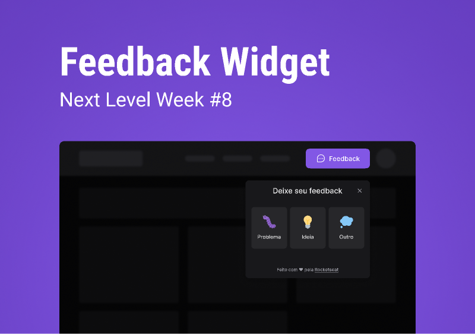

  

 

## 💻 Projeto

O FeedGet é uma aplicação simples, um botão que ao clicar abre uma pequena janela no canto inferior da tela para enviar feedbacks sobre o site. Desenvolvido durante a NLW Return da Rocketseat possuindo versões Web (front e back-end) e mobile.

## ✨ Tecnologias

### Front-end Web

- [ ] ReactJS
- [ ] TailwindCSS
- [ ] Phosphor Icons
- [ ] Figmoji
- [ ] Nodemailer
- [ ] HTML2Canvas
- [ ] Vite

### Back-end

- [ ] Node.js
- [ ] Jest
- [ ] Prisma
- [ ] CORS
- [ ] Express
- [ ] PostgreSQL

### Mobile

- [ ] React Native
- [ ] Typescript
- [ ] Expo
- [ ] Context API
- [ ] Phosphor Icons
- [ ] Figmoji
- [ ] Axios
- [ ] Expo Google Fonts
- [ ] React Navigation Stack
- [ ] React Native Gesture Handler

## 🔖 Layout

Você pode visualizar o layout do projeto através [desse link](https://www.figma.com/community/file/1102912516166573468/Feedback-Widget). É necessário ter conta no [Figma](http://figma.com/) para acessá-lo.

## Acesso a aplicação

Você pode visitar a aplicação [clicando aqui](https://feedget-web.vercel.app/)

## 📄 Licença

Esse projeto está sob a licença MIT. Veja o arquivo [LICENSE](.github/LICENSE.md) para mais detalhes.

 
